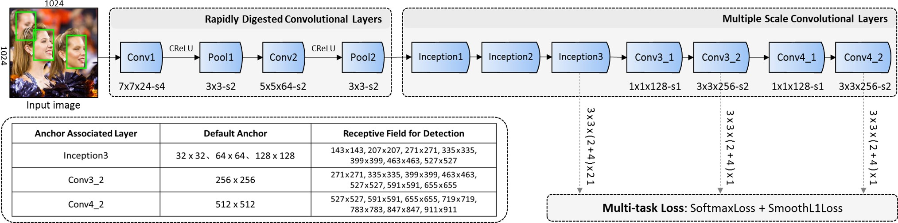

# FaceBoxes Tensorflow

<div align="center">
  
</div>

## Description

This project is an implementation of this [paper](https://arxiv.org/abs/1708.05234) with the help of this [repo](https://github.com/TropComplique/FaceBoxes-tensorflow) which proposes a solution that compines the speed and accuracy of performance for the state-of-art problem of face detection.

It is part of [Smart Exam Website](https://github.com/Smart-Exam-Website) project in which it serves the feature of detecting the faces of the present individuals in front of the camera and returns the number of faces detected to indicate if there is someone beside the student helping in cheating in the exam or not.


## Table of Contents
1. [Pipeline](#pipeline)
2. [Dependencies](#dependencies)
3. [How to use the project](#how-to-use-the-project)
4. [Credtis](#credits)

## Pipeline
<div align="center">
  
</div>

## Dependencies:

    Python 3.9.7
    Tensorflow 2.8.0 (but the part of saving model and creating pb file needs Tesnsorflow 1.12)
    Pandas
    NumPy
    CV2
    matplotlib
    PIL
    tqdm
    flask
    flask_restful

## How to use the project.
### Pre-trained model
To use the pre-trained model, you need to download the frozen graph file (```model.pb```) from [here](https://drive.google.com/drive/folders/1D6vTNt6kiGT4pp6zI0C7-B0_fBw-Jcil?usp=sharing) and run ```api.py``` file (which depends on face_detector file) or use ```try_detector.ipynb``` notebook

### Evaluation
To evaluate the model using [FDDB](http://vis-www.cs.umass.edu/fddb/) dataset go into ```Testing``` directory and:

  1. Download FDDB files from [here](https://drive.google.com/drive/folders/1Msy4RJS7aAqQng1VfjbNsPJ5JSkUkdfR?usp=sharing) into ```fddb``` folder
  2. Put the ```model.pb``` file in Testing directory
  3. Run ```explore_and_convert_FDDB.ipynb``` file to prepare the dataset to be ready for evaluation
  4. Run ```predict_for_FDDB.ipynb``` file to get the detections
  5. Go into ```eval_result``` and run ```create_roc_files.py``` to produce the discrete ROC & continous ROC files using this command ```python create_roc_files.py ../fddb/result/detections.txt FDDB-result/```
  6. To visualize the FDDB annotations on the images run ```visulaize_original_annotations.ipynb```

### Fine-Tuning
I tried to train the model on [MAFA](https://imsg.ac.cn/research/maskedface.html) Dataset using *Google Colab*

To train the model you need to:
1. Upload ```explore_and_prepare_MAFA.ipynb``` and ```train_model.ipynb``` as new colab notebook
2. Upload the rest of the files in ```Training``` directory on your google drive
3. Run ```explore_and_prepare_MAFA.ipynb``` file to prepare the dataset to be ready for training
4. Run ```train_model.ipynb``` file to train the model on the prepared data, knowing that you have to continue training from the last checkpoint ```run00``` found [here](https://drive.google.com/drive/folders/1D6vTNt6kiGT4pp6zI0C7-B0_fBw-Jcil?usp=sharing)
5. To export the training result into .pb file you will need to run the following files, which are in ```save_&_create_pb``` directory, locally using ```Tesnsorflow 1.12```:
  5.1 run ```save.py``` to export a saved model
  5.2 run ```create_pb.py``` using this command ```python create_pb.py --saved_model_folder="export/run02/__some_tmp_num__" --output_pb="model_2.pb"```
6. Finally use the created ```model_2.pb`` to evaluate it and use it in inference

For more details about the files dependencies and quick notes about each file, you can find it [here](https://drive.google.com/drive/folders/1BWwN0BDxybPw2crOg98ALnc4V3x-0FXY?usp=sharing) 

## Credits
This project is inspired by [this repo](https://github.com/TropComplique/FaceBoxes-tensorflow)
